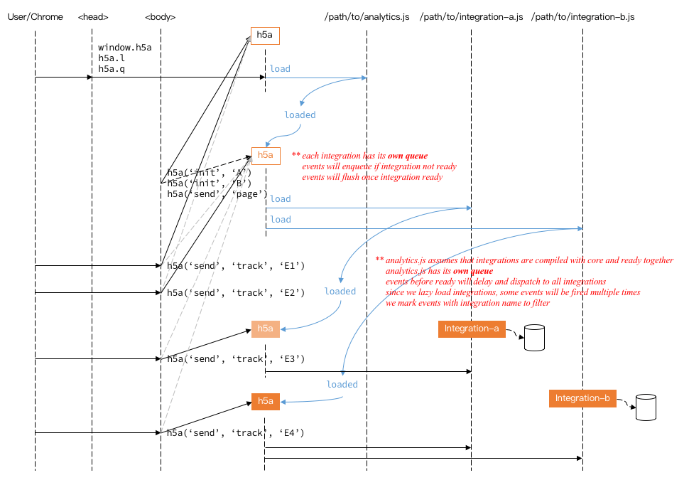

h5-analytics
==

enhanced analytics.js

Legal Call
==

```javascript
// 1. init
h5a('init', 'Google Analytics', { trackingId: 'xxxx-xxxx' });
h5a('init', 'Latte Bank Interface', { gif: '/path/to/collect/gif.gif' });

// 2. page
h5a('send', 'page');
h5a('send', 'page', properties);
h5a('send', 'page', properties, options); // * EXPERT *

// 3. send track
h5a('send', 'track', action);
h5a('send', 'track', action, properties);
h5a('send', 'track', action, properties, options); // * EXPERT *

// 4. send exception
// TBD

// ** @param action [String]
const action = 'ACTION_NAME_可以中文';

// ** @param properties [JSON] is a one level, plain js object; no functions; prefer string for all values
const properties = {
  mobile: '13812345678',
  email: 'example@example.com',
  extra: 'value',
};
```

Deprecated
==

```javascript
h5a('init', {
  'Google Analytics': {
    trackingId: 'xxxx-xxxx',
  },
  'Latte Bank Interface': {
    gif: '/path/to/collect/gif.gif',
  },
})
```

Illegal Call
==

```javascript
h5a('send', 'track'); // * action required *
```

Expert
==

Flow
==


